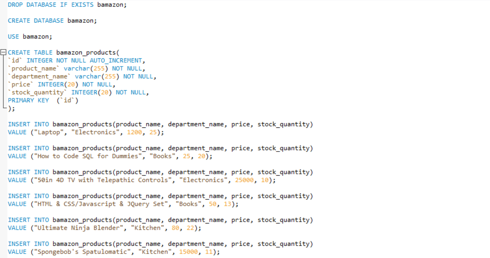
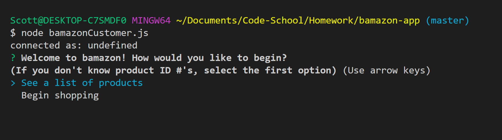
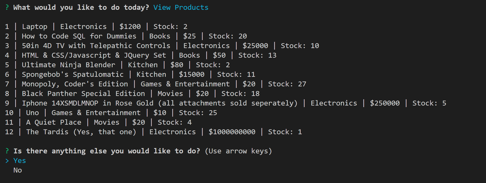

# Bamazon Storefront Application
This introductory project to SQL and node creates an Amazon-esque app on a small scale. Functions of the app include displaying a list of current stock and the properties related to them, and future updates will include departmental components to help simulate an actual business model. 

## Summation

This app replicates an online store such as Amazon or Ebay in order to show the power of database use at a very simple level. Future updates will include a Manager and Regional application that allows for greater manipulation of the database and control over inventory and pricing including configuring overhead costs and managing "success" of various departments.Lan

## Languages Used

This application uses JavaScript (Node.js) and mySQl as its database.

## Setup in SQL

## Intro: Bamazon Customer App

To begin, the app welcomes you and gives you two options: One to see a list of all of the products offered for people new to Bamazon, and another to begin the shopping experience: 

## Product List

If the customer chooses to see a list of products, the app reaches into the created SQL database and retrieves a list of the products' ID numbers, names, departments, prices, and quantity available:

## Start Shopping

If the customer chooses to begin shopping instead, or decides to shop after seeing the product list, they are asked to enter a product ID number and the quantity of that item they would like to purchase:

 ## Within Stock Quantity

If the amount purchased is lower than the amount of the product that is available, the customer is given a thank you message with the price of the items chosen, and then are asked whether they would like to continue shopping: 

## Over Stock Quantity

If the amount purchased is greater than the amount of the product that is available, the customer is given the option to purchase a different amount, purchase a different product, or end their shopping experience: 

Choosing to choose a different product or amount resets their shopping experience: 

## Ending the Shopping Experience

If the user chooses to end their shopping experience after purchasing or if they ask for more than is available, they are given a thank you message and the app ends: 

## Intro: Bamazon Manager App

In this application, the user takes on the role of the manager of Bamazon. As a manager, the user is given four options: 

<ol>
 <li>View the inventory that is currently available</li>
 <li>View the inventory that is currently low</li>
 <li>Add more inventory to an existing item</li>
 <li>Add a new item to Bamazon</li>
</ol>

## Viewing Current Inventory

In the same way that the Customer app showed the inventory that was avaialable for them to purchase, the Manager version of the app loops through the products in the SQL database and displays them for the user to see. The user is then asked if they have any other business while on the app:

## Viewing Low Inventory

This function allows the user to see all products that currently have a stock quantity of 5 or less. The user is then asked whether they would like to add inventory. If no, the user is then asked if they have any other business while on the app: 

## Adding to Current Inventory

Here, the user is asked to pick which item he would like to add inventory to, and then asked the amount of that item they would like to add to the store. Afterward, the user receives a messsage with the updated amount of inventory for the item they selected. The user is then asked if they have any other business while on the app: 

## Adding New Inventory

In this function, the user is prompted to input the name, department name, price, and amount to stock of a new item. The item is then added to the SQL Database and a message shows the user the name, department, and stock amount of the item that was added: 

## Ending the Manager App

If at any time the user chooses the "no" option after being asked if they had more business to do while on the app, they are given a thank you message and the application is ended:

